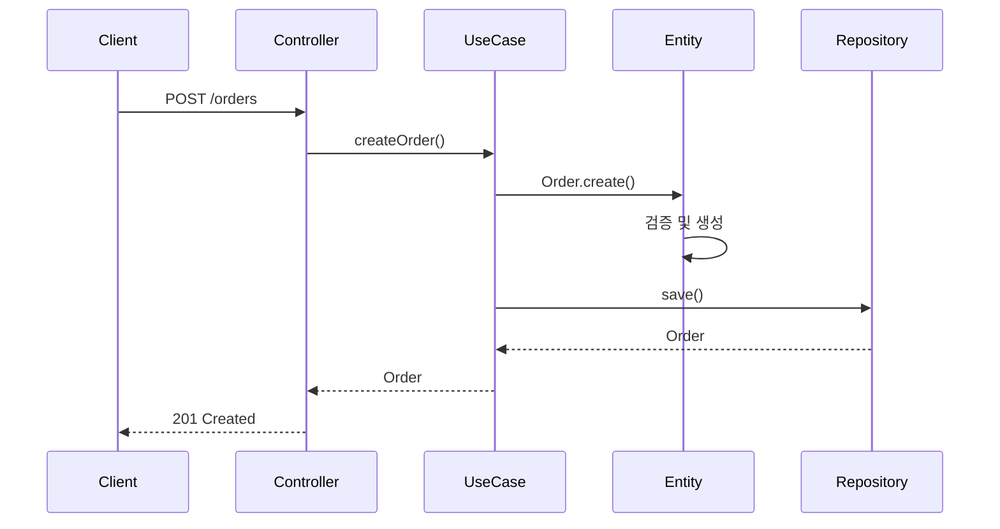

# 빈 아키텍처 템플릿

## 목적
Phase B에서 사용자가 직접 전체 아키텍처를 스케치하도록 유도한다.

---

## 템플릿

```markdown
# 아키텍처 스케치

## 1. Domain Layer

### Entities
| Entity | 식별자 | 핵심 속성 | 핵심 행동 |
|--------|--------|----------|----------|
|        |        |          |          |

### Value Objects
| VO | 속성 | 불변식 |
|----|------|--------|
|    |      |        |

### Domain Services
| Service | 책임 | 사용 Entity |
|---------|------|-------------|
|         |      |             |

### Domain Events
| Event | 발생 시점 | 포함 정보 |
|-------|----------|----------|
|       |          |           |

### Policies / Specifications
| 이름 | 규칙/조건 |
|------|----------|
|      |          |

---

## 2. Application Layer

### Use Cases / Application Services
| UseCase | 사용자 행동 | 참여 객체 |
|---------|-------------|----------|
|         |             |          |

### Event Handlers
| Handler | 처리 Event | 후속 작업 |
|---------|-----------|----------|
|         |           |          |

---

## 3. Infrastructure Layer

### Parsers
| Parser | 입력 형식 | 출력 |
|--------|----------|------|
|        |          |      |

### Extractors
| Extractor | 소스 | 추출 대상 |
|-----------|------|----------|
|           |      |          |

### External Clients
| Client | 외부 시스템 | 통신 방식 |
|--------|-----------|----------|
|        |           |          |

---

## 4. Interface Layer

### Controllers
| Controller | API 그룹 | 주요 Endpoint |
|------------|---------|---------------|
|            |         |               |

---

## 5. 협력 흐름도 (Collaboration Flow)

### [유스케이스명] 흐름
```
[사용자가 직접 그리는 영역 - Mermaid 또는 텍스트]
```

### 이벤트 흐름
```
[사용자가 직접 그리는 영역]
```
```

---

## 계층별 작성 가이드

### Domain Layer

**Entities**
- 식별자로 구분되는 객체
- 상태와 행동을 함께 가짐
- 예: Order, User, Product

**Value Objects**
- 식별자 없이 값으로만 구분
- 불변 객체
- 예: Money, Email, Address

**Domain Services**
- 두 개 이상 Entity가 관여하는 로직
- 상태를 가지지 않음
- 예: TransferService (계좌 이체)

**Domain Events**
- 도메인 내에서 발생한 사실
- 과거형으로 명명
- 예: OrderCreated, PaymentCompleted

**Policies / Specifications**
- 복잡한 비즈니스 규칙
- 재사용 가능한 조건
- 예: DiscountPolicy, CancelSpecification

### Application Layer

**Use Cases**
- 사용자 관점에서의 행동
- 하나의 트랜잭션
- 예: CreateOrderUseCase, CancelOrderUseCase

**Event Handlers**
- Domain Event에 반응
- 후속 작업 수행
- 예: OrderCreatedHandler (이메일 발송)

### Infrastructure Layer

**Parsers**
- 외부 데이터 파싱
- 입력 형식 → 도메인 객체
- 예: CsvParser, JsonParser

**Extractors**
- 외부 소스에서 데이터 추출
- 예: ApiExtractor, FileExtractor

**External Clients**
- 외부 시스템 통신
- 예: PaymentGateway, NotificationClient

### Interface Layer

**Controllers**
- HTTP 요청 처리
- UseCase 호출
- 예: OrderController, UserController

---

## 협력 흐름도 작성 가이드

### Mermaid 시퀀스 다이어그램 예시



### 이벤트 흐름 예시

```
Order.created → OrderCreatedEvent
  → OrderCreatedHandler
    → NotificationService.sendEmail()
    → InventoryService.reserve()
```

---

## STOP Protocol (Phase B 완료)

```
---
👆 빈 아키텍처 템플릿을 작성해주세요.
작성 완료 후 "완료" 또는 "다음"이라고 입력해주세요.
Phase C (Implementation)로 진행합니다.
```
